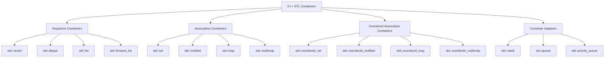

# C++ STL Containers Overview

Below is a tree diagram of the main C++ STL container types, with complexity and usage notes for each.

---

## Container Details

### Sequence Containers
| Container         | Complexity (Insert/Access) | Best Use Case                  |
|-------------------|---------------------------|--------------------------------|
| std::vector       | O(1)/O(1)                 | Fast random access, dynamic array |
| std::deque        | O(1)/O(1)                 | Fast insert/remove at ends        |
| std::list         | O(1)/O(n)                 | Frequent insert/remove anywhere   |
| std::forward_list | O(1)/O(n)                 | Memory-efficient singly linked    |

### Associative Containers
| Container         | Complexity (Insert/Find)   | Best Use Case                  |
|-------------------|---------------------------|--------------------------------|
| std::set          | O(log n)/O(log n)         | Unique sorted elements         |
| std::multiset     | O(log n)/O(log n)         | Sorted elements, duplicates    |
| std::map          | O(log n)/O(log n)         | Key-value pairs, sorted keys   |
| std::multimap     | O(log n)/O(log n)         | Multiple values per key        |

### Unordered Associative Containers
| Container              | Complexity (Insert/Find) | Best Use Case                  |
|------------------------|-------------------------|--------------------------------|
| std::unordered_set     | O(1)/O(1)               | Unique elements, fast lookup   |
| std::unordered_multiset| O(1)/O(1)               | Duplicates, fast lookup        |
| std::unordered_map     | O(1)/O(1)               | Key-value, fast lookup         |
| std::unordered_multimap| O(1)/O(1)               | Multiple values per key        |

### Container Adapters
| Container         | Underlying Container | Best Use Case                  |
|-------------------|---------------------|--------------------------------|
| std::stack        | vector/deque/list   | LIFO stack operations          |
| std::queue        | deque/list          | FIFO queue operations          |
| std::priority_queue| vector/deque        | Priority-based queue           |

---

**Tips:**
- Use `std::vector` for most dynamic arrays.
- Use `std::set`/`std::map` for sorted data.
- Use unordered containers for fastest lookup (not sorted).
- Use adapters for stack/queue behaviors.

